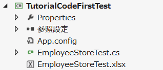

FixtureBook
===========

1. FixtureBook とは
-------------------

FixtureBook とは単体テストで使用するデータを .xlsx ファイルに記述できるようにするための仕組みです。

### 1.1 機能

FixtureBook を使うと、.xlsx ファイル上に記述した以下のようなデータを単体テストで簡単に利用することができます。

*   テスト前にDBテーブルに登録しておきたいデータ内容。
*   テスト対象メソッドの引数等として利用するオブジェクトのプロパティ値。
*   テスト対象メソッドを実行して取得できた結果と照合するための予想結果。
*   テスト後のDBテーブルのあるべき状態を表すデータ。


### 1.2 どんなアプリに使える？

Webアプリケーションのバックエンドロジック等、
データベースの入出力を中心としたクラスのテストに向いています。


### 1.3 特徴

#### テストコードが非常にシンプル

テストコードが非常にシンプルになります。

```c#
    FixtureBook.ExpectReturn((Employee parameter) => dao.GetEmployees(parameter));
```

この1行のコードで、

1.  データベースに必要なデータをセットアップし、
2.  parameter オブジェクトを作成し、
3.  `dao.GetEmployees(parameter)` を実行し、
4.  その戻り値を予想結果と比較する

という処理が行えます。


#### 設定が簡単

1.  NuGet でインストールして、
2.  App.config に [データベースへの接続設定をする](./Document/Tutorial-Setup.md) 

だけで使い始められます。


#### APIがシンプル

利用するのは `FixtureBook` クラスだけです。


2. 使い方
---------

### 2.1 インストール方法

[NuGet](https://www.nuget.org/packages/FixtureBook/) でインストールするのが簡単です。


### 2.2 基本的な使い方

FixtureBook の使い方はとてもシンプルです。

1.  テストで使用したいデータを FixtureBook (.xlsx ファイル) に記述する。
2.  FixtureBook を利用する単体テストを書く。

### 2.3 利用例

例えば、以下のような「従業員クラス (Employee)」

```c#
    public class Employee
    {
        public int Id { get; set; }
        public string Name { get; set; }
        public int Age { get; set; }
        public bool Retire { get; set; }
        public DateTime LastUpdated { get; set; }
    }
```

を利用するメソッド GetEmployees

```c#
    public class EmployeeStore
    {
        /// <summary>
        /// 従業員データの退職フラグを条件にしてデータベースから検索を行う
        /// </summary>
        /// <param name="parameter">退職フラグが設定された従業員データ</param>
        /// <returns>検索条件に合致した従業員データ</returns>
        public List<Employee> GetEmployees(Employee parameter)
        {
            using (MyAppDbContext context = new MyAppDbContext())
            {
                return (from employee in context.Employees
                        where employee.Retire == parameter.Retire
                        orderby employee.Id
                        select employee).ToList();
            }
        }
    }
```

をテストしたい場合の例です。


#### 2.3.1 FixtureBook 記述例

次のようなシートのある .xlsx ファイルを作ります。


*   `A.テストケース` の<b>C列</b>にテスト内容を一行で記述する。
*   テスト前にデータベース上に設定しておきたいデータを `B.テストデータクリア条件` と `C.テストデータ` に記述する
    （<b>C列</b>にテーブル名、<b>D列</b>以降に列値を指定）。
*   `D.パラメタ`には、メソッドの引数で渡すデータを記述する（<b>C列</b>にクラス名、<b>D列</b>以降にプロパティ値を指定）。
*   `E.取得データ`には、メソッドの戻り値として取得できるデータを予想して記述する（<b>C列</b>にクラス名、<b>D列</b>以降にプロパティ値を指定）。

作成した .xlsx ファイルは単体テストクラスのソースファイルと同じ名前にして（EmployeeStoreTest.cs ならば EmployeeStoreTest.xlsx とする）、
単体テストクラスのソースファイルと同じフォルダに保存します。




#### 2.3.2 単体テスト記述例

単体テストは以下のように記述します。

*   `using XPFriend.Fixture;` を追加する。
*   `Excelシート名__テストケース記述` という名前でテストメソッドを作成する。
*   FixtureBook.ExpectReturn メソッドでテスト対象メソッドを呼び出して、予想結果のチェックを行う。

&nbsp;

    ...
    using XPFriend.Fixture;

    ...

    [TestClass]
    public class EmployeeStoreTest
    {
        [TestMethod]
        public void GetEmployees__引数の退職フラグがtrueの場合データベーステーブルEmployees上の退職者のみが取得できる()
        {
            FixtureBook.ExpectReturn((Employee parameter) => new EmployeeStore().GetEmployees(parameter));
        }
    }

このテストを実行すると、以下の処理が行われます。

1.  `B.テストデータクリア条件` に記述された条件でデータベーステーブルからデータ行を削除した後に
    `C.テストデータ` に記述されたデータがデータベーステーブルに追加される。
2.  `D.パラメタ` に記述された内容で Employee クラスのインスタンスが作成され、引数（ `Employee parameter` ）として渡される。
3.  テスト対象処理 `new EmployeeStore().GetEmployees(parameter)` が実行される。
4.  `GetEmployees` の戻り値が `E.取得データ` に記述した内容と合致しているかどうかがチェックされる。

##### 参考
>この例では、`ExpectReturn` を使いましたが、
>戻り値をチェックしない場合には `Expect`、
>例外発生をチェックしたい場合には `ExpectThrown` が利用可能です。

>Excelシート名とテストクラス名が同じ場合は、`Excelシート名__テストケース記述` というテストメソッド名の代わりに
>`テストケース記述` というふうに Excel シート名を省略した形のメソッド名にすることもできます。


3. API
------

### 3.1 FixtureBook クラスのメソッド

FixtureBook の操作は以下のメソッドでできます。

<table>
  <tr><td>Setup</td><td><code>B.テストデータクリア条件</code>に記述された条件でデータベースからデータ削除した後に<code>C.テストデータ</code>に記述されたデータをデータベースに追加する。</td></tr>
  <tr><td>GetObject / GetList / GetArray</td><td><code>D.パラメタ</code>に記述した内容で初期化されたオブジェクトを取得する。</td></tr>
  <tr><td>Validate</td><td>引数に指定されたオブジェクトが<code>E.取得データ</code>に記述した予想結果と同じかどうか検証する。</td></tr>
  <tr><td>ValidateStorage</td><td>DB上のデータが<code>F.更新後データ</code>に記述した予想結果と同じかどうか検証する。</td></tr>
  <tr><td>Expect</td><td>(1)Setup でデータのセットアップを行い, (2) GetXxx でパラメタオブジェクトを取得し、(3) 引数に指定された処理を実行し、(4) ValidateStorage でデータ状態の検証を行う。</td></tr>
  <tr><td>ExpectReturn</td><td>(1)Setup でデータのセットアップを行い, (2) GetXxx でパラメタオブジェクトを取得し、(3) 引数に指定された処理を実行し、(4) Validate で実行した処理の戻り値を検証し、(5) ValidateStorage でデータ状態の検証を行う。</td></tr>
  <tr><td>ExpectThrown</td><td>(1)Setup でデータのセットアップを行い, (2) GetXxx でパラメタオブジェクトを取得し、(3) 引数に指定された処理を実行し、(4) Validate で実行した処理中に発生した例外を検証し、(5) ValidateStorage でデータ状態の検証を行う。</td></tr>
</table>


### 3.2 FixtureBook 属性と Fixture 属性

以下のように、クラスまたはメソッドに `[FixtureBook]` 属性を指定すると、
利用する .xlsx ファイルのパスを明示的に指定できます。

```c#
    [TestClass]
    [FixtureBook("Test/More/EmployeeStoreTest_02.xlsx")]
    public class EmployeeStoreTest
```

`[FixtureBook]` 属性がクラスとメソッドの両方に付いている場合は、
メソッドで指定されたパスが優先的に利用されます。


「A.テストケース」記述の内容とメソッド名を同じにしたくない（または同じにできない）場合は、
以下のように `[Fixture]` 属性が利用できます。

```c#
    [TestMethod]
    [Fixture("GetEmployees", "引数の退職フラグがtrueの場合データベーステーブルEmployees上の退職者のみが取得できる")]
    public void TestMethod1()
```


4. 利用上の制約
---------------

FixtureBook には現在のところ以下の制約があります。

*   Excelファイルは `.xlsx` 形式のみ利用可能 (`.xls` 形式ファイルは利用できない)。
*   利用可能なデータベースは Oracle および SQLServer です。


5. もっと詳しく!
----------------

FixtureBook について、もっと詳しく知りたいときは、以下のドキュメントも参照してみてください。

### チュートリアル

*   [#01 セットアップ](./Document/Tutorial-Setup.md)
*   [#02 Entity Framework コードファースト開発での利用例](./Document/Tutorial-CodeFirst.md)
*   [#03 DataSet / DataTableを使った開発での利用例](./Document/Tutorial-DataSet.md)


### リファレンス

*   [FixtureBook 記述ルール](./Document/FixtureBookReference.md)
