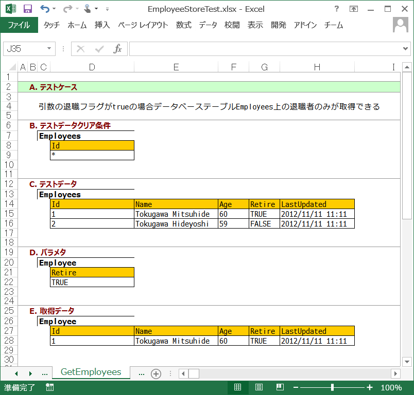

FixtureBook
===========

FixtureBook とは
----------------

FixtureBook とは単体テストで使用するデータを .xlsx ファイルに記述できるようにするための仕組みです。


機能
----

FixtureBook を使うと、.xlsx ファイル上に記述した以下のようなデータを単体テストで簡単に利用することができます。

*   テスト前にDBテーブルに登録しておきたいデータ内容。
*   テスト対象メソッドの引数等として利用するオブジェクトのプロパティ値。
*   テスト対象メソッドを実行して取得できた結果と照合するための予想結果。
*   テスト後のDBテーブルのあるべき状態を表すデータ。


セットアップ方法
----------------

[NuGet](https://www.nuget.org/packages/FixtureBook/) でインストールするのが簡単です。


使い方
------

FixtureBook の使い方はとてもシンプルです。

1.  テストで使用したいデータを FixtureBook (.xlsx ファイル) に記述する。
2.  FixtureBook を利用する単体テストを書く。


FixtureBook 利用例
--------------------

ここでは、以下のような「従業員クラス (Employee)」

```c#
    public class Employee
    {
        public int Id { get; set; }
        public string Name { get; set; }
        public int Age { get; set; }
        public bool Retire { get; set; }
        public DateTime LastUpdated { get; set; }
    }
```

を使用した、以下のようなメソッド（UpdateRetire）

```c#
    public class RetireHandler
    {
        /// <summary>
        /// 年齢が60才以上ならば退職フラグを true にして名前を消去する。
        /// </summary>
        /// <param name="data">従業員データ</param>
        public void UpdateRetire(Employee data)
        {
            if (data.Age >= 60)
            {
                data.Retire = true;
                data.Name = null;
            }
        }
    }
```

をテストしたい場合の例を説明します。


### FixtureBook 記述例



*   `A.テストケース` の<b>C列</b>にテスト内容を一行で記述する。
*   `D.パラメタ`には、テストに使用するデータを記述する（<b>C列</b>にクラス名、<b>D列</b>以降にプロパティ値を指定）。
*   `E.取得データ`には、テスト後の予想結果データを記述する（<b>C列</b>にクラス名、<b>D列</b>以降にプロパティ値を指定）。
*   セルの書式や図形は自由に記述可能。

作成した .xlsx ファイルは単体テストクラスのソースファイルと同じ名前にして（RetireHandlerTest.cs ならば RetireHandlerTest.xlsx とする）、
単体テストクラスのソースファイルと同じフォルダに保存してください。


### 単体テスト記述例

単体テストでは以下の記述を行います。

*   `using XPFriend.Fixture;` を指定する。
*   テストメソッドの名前は `Excelシート名__テストケース記述` とする。
*   FixtureBook (.xlsx ファイル) の利用は FixtureBook クラスのメソッドを使って行う。

&nbsp;

    (..略..)
    using XPFriend.Fixture;

    (..略..)

    [TestClass]
    public class RetireHandlerTest
    {
        private FixtureBook fixtureBook = new FixtureBook();

        [TestMethod]
        public void UpdateRetire__年齢が60才以上ならば退職フラグをtrueにして名前を消去する()
        {
            // setup : 「D.パラメタ」に記述した内容でオブジェクト作成する
            Employee data = fixtureBook.GetObject<Employee>();

            // when : テスト対象メソッドを呼び出す
            new RetireHandler().UpdateRetire(data);

            // then : data が「E.取得データ」に記述した予想結果と同じかどうか検証する
            fixtureBook.Validate(data);
        }
    }


FixtureBook クラスのメソッド
----------------------------

以下のメソッドが利用可能です。

<table>
  <tr><td>Setup</td><td><code>B.テストデータクリア条件</code>に記述された条件でDBからデータ削除した後に<code>C.テストデータ</code>に記述されたデータをDBに追加する。</td></tr>
  <tr><td>GetObject / GetList / GetArray</td><td><code>D.パラメタ</code>に記述した内容で初期化されたオブジェクトを取得する。</td></tr>
  <tr><td>Validate</td><td>引数に指定されたオブジェクトが<code>E.取得データ</code>に記述した予想結果と同じかどうか検証する。</td></tr>
  <tr><td>ValidateStorage</td><td>DB上のデータが<code>F.更新後データ</code>に記述した予想結果と同じかどうか検証する。</td></tr>
</table>


FixtureBook 属性と Fixture 属性
-------------------------------

以下のように、クラスまたはメソッドに `[FixtureBook]` 属性を指定すると、
利用する .xlsx ファイルのパスが指定できます。

```c#
    [TestClass]
    [FixtureBook("Examples/RetireHandler.xlsx")]
    public class RetireHandlerTest
```

`[FixtureBook]` 属性がクラスとメソッドの両方に付いている場合は、
メソッドで指定されたパスが優先的に利用されます。


「A.テストケース」記述の内容とメソッド名を同じにしたくない（または同じにできない）場合は、
以下のように `[Fixture]` 属性が利用できます。

```c#
    [TestMethod]
    [Fixture("UpdateRetire", "年齢が60才以上ならば退職フラグをtrueにして名前を消去する")]
    public void TestMethod1()
```


利用上の制約
------------

FixtureBook には現在のところ以下の制約があります。

*   Excelファイルは `.xlsx` 形式のみ利用可能 (`.xls` 形式ファイルは利用できない)。
*   利用可能なデータベースは Oracle および SQLServer です。


もっと詳しく!
-------------

FixtureBook について、もっと詳しく知りたいときは、以下のドキュメントも参照してみてください。

### チュートリアル

*   [#01 セットアップ](./Document/Tutorial-Setup.md)
*   [#02 Entity Framework コードファースト開発での利用例](./Document/Tutorial-CodeFirst.md)
*   [#03 DataSet / DataTableを使った開発での利用例](./Document/Tutorial-DataSet.md)


### リファレンス

*   [FixtureBook 記述ルール](./Document/FixtureBookReference.md)
